\page userguide User Guide
\tableofcontents

CodeCompass is a static code analyzer tool which is planned to understand large
code bases. In this document we introduce the usage of CodeCompass.

\section uistruct User interface structure
The user interface has three main parts:

- Text search in header
- Accordion modules on the left
- Center module

<!-- TODO We need an overview picture here -->

\subsection searchmodule Text Search
In the search header one can search for text phrases in the whole source code.
See [search](#search).

\subsection accordionmodules Accordion Modules
 
\subsubsection ptree File managers
The file managers shows the directory hierarchy and files of the project. 
In header file manager shows the actual directory path. 
Two types of file manager:
  * MC Style - shows only the actual directory content. 
  * Tree Style - shows directories/files in tree style.
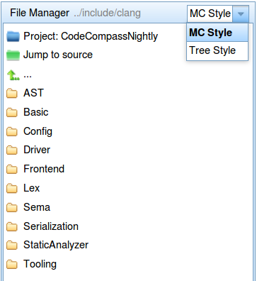

\subsubsection itree Info Tree
Info tree shows language specific data about different language elements such as
macros, called/caller functions of a function, class hierarchy, function pointer
analysis, variable reads/writes, etc. These information can be reached via the
programming language context menu which pops up on right click on the source
code. The description of these are available below.

\subsubsection queryresults Query Results
In Query Results panel one can see the results of text search and other kind of
reference search (definition, usage, etc.).

\subsubsection browsinghistory Browsing History
Browsing history shows the path of the source code's iteration in a tree
structure. When a file is opened via [project tree](#ptree), [info tree](#itree)
or [query results](#queryresults) then a new tree node is added under the root.
In case of jumps (e.g. jump to definition) the new tree node is added under the
current node.

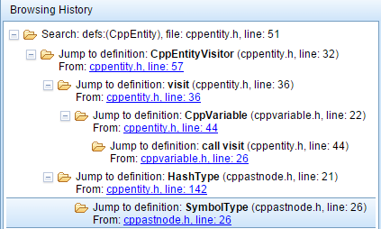

The nodes of the tree can be clicked thus jumping back to a previous position
in source code browsing. The browsing tree also follows the state of the
browser's own history as long as the page is not reloaded.

\subsubsection repositorynavigator Revision Control Navigator (GIT Navigator)
The revision control navigator allows to search in the GIT repositories, visualize
branches and merges, list and show commit diffs.

On the revision control navigator slider you can list GIT repositories, branches
in a given repository and commits for a given branch. You can search
among the commits based on the commiter name or commit text. Once a specific
commit is selected, you can see the modified/added/removed files. You can 
visualize the changes in side-by-side change view.

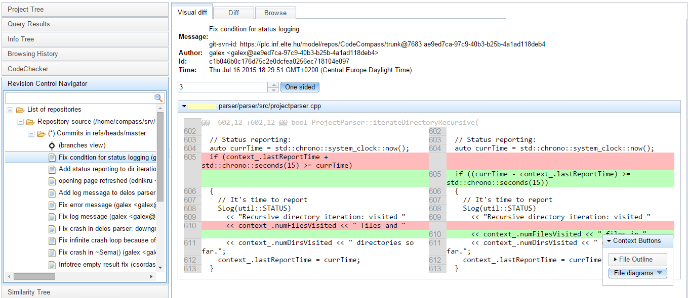

You can also visualize how the branches are merged in the "branches view".

__Blame View__

If you right click in the source code and select "Team/Blame View" you can see
when was the last modification of a given source line. You can see name of the
commiter, and the date of the last change. Most recent changes are colored
into light green, oldest changes into dark red.

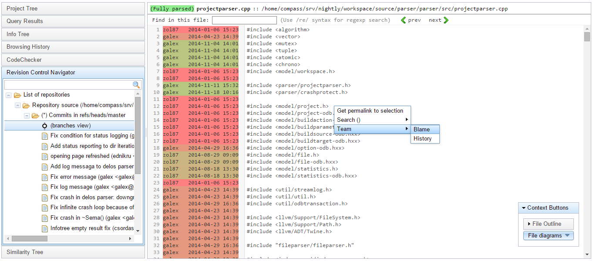

\subsubsection codechecker CodeChecker (finding bugs)

[CodeChecker](https://github.com/Ericsson/codechecker) is a defect analyzer tool for C and C++ based on [Clang Static
Analyzer] (http://clang-analyzer.llvm.org/). The results are shown in the
CodeChecker slider.

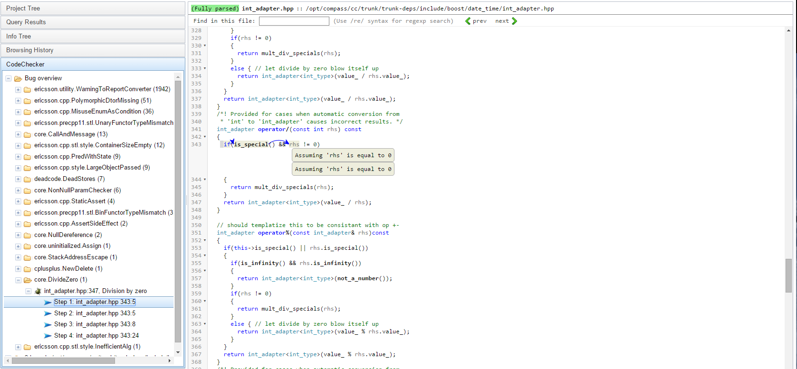

You can list the bugs found in the whole project or in the currently open file.
In case the defect found is false positive, you can suppress the bug by pressing
the "suppress bug" button.

\subsection centermodules Center Modules

\subsubsection textview Text view
The text view shows the source code of an opened file. 
It supports context sensitive popup menu for different language
elements. This means that the content of this menu depends on the clicked
token. For example if the token belongs to a function call, then in the context
menu you can see function related diagrams, references on called and caller
functions, etc. Or on a node which belongs to a user type, you can display
class diagrams.

In this source code view you can also see the usages of a given language element
by simply clicking on it. A click on such an element select all of its usage in
the current file.

The text view can be opened by clicking on a file in the [project tree](#ptree).
The text view has a header and a body part.
The header contains the opened file's name and path. 
The elements of this path can be clicked which helps to jump to the
corresponding node in the [project tree](#ptree).

The header also contains information about the state of parsing. 
A file can be
Fully parsed,
Partially parsed or
Only in search index.
- "Fully parsed" state means that the compiler has managed to parse the whole 
currently opened file, so you can click on any language element with right 
mouse button to pop up a context sensitive menu.
- In case of "Partially parsed" state there may be parts in the file on which
the right cilck supports only text search.
- "Only in search index" means, 
that the current file didn't participate in parsing progress at all, so right 
click in every part of the file supports only text search. 

Clicking on parse status one can see the compile time warnings and notes in a
table.
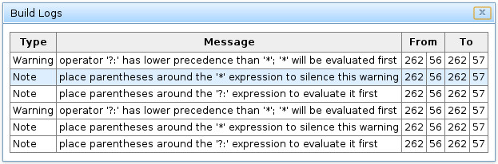

The rows of this table are clickable which thus jumps to the corresponding line
in the source code.m

\subsubsection diagramview Diagram View
Source code and file related diagrams are shown in the center view. The
description of these diagrams can be found below.

When a diagram is opened, the center module is devided to two parts: the diagram
itself and the source code. The diagram is in SVG format. This is an interactive
diagram in the sense that the nodes can be clicked and mouse can be hovered. In
case of mouse click the clicked node will be the current one, thus one can see
the diagram from the view of another node. Hovering the mouse on a node displays
the source code which belongs to the given node. In case of a function call
diagram these are function definitions, in case of class diagram these are
files, in case of build diagram these are whole files, etc.

\subsubsection revisionview Revision Control View
Revision Control overview is shown in the center view.

\section search Search

\subsection searchtypes Search types
CodeCompass supports the following types of search: Text, Definition, File name
and Log.

\subsubsection txtsrc Text Search
A query is broken up into terms and operators. There are two types of terms: 
Single Terms and Phrases. A Single Term is a single word such as "test" or 
"hello". A Phrase is a group of words surrounded by double quotes such as
"hello dolly". Multiple terms can be combined together with Boolean operators 
to form a more complex query (see below).

With "Text Search" you can search for terms from indexed documents. If there is
no Boolean operator(s) between two words (terms), the OR operator is used.

#### Text Search syntax
For Text Search you can use wildcards, regex and logical operators:

##### Escaping Special Characters
You can (and should) escape the following characters with a back slash "\"
character:

    +  -  &&  ||  !  (  )
    {  }  [  ]  ^  "  ~  *
    ?  \  /

##### Phrases
A Phrase is a group of words surrounded by double quotes such as "hello dolly".
A Phrase query matches iff the words are next to each other in the particular
order.

##### Wildcards
You can use single and multiple character wildcard searches within single terms
but you cannot use wildcard searches within phrase queries.

Example:

    *test => matches documents that contains word(s) that ends with test.

More examples:

    te?t
    test*
    te*t

In phrases you cannot use wildcards (the wildcard characters are parsed as
simple characters):

    "te*t text" => in this case the * is not a wildcard!

##### Regular Expression
You can use a regular expression pattern between forward slashes.

Example:

    /[mb]o.*at/

##### Boolean operators
Boolean operators allow terms to be combined through logic operators.

###### OR
The OR operator links two terms and finds a matching document if either of the
terms exist in a document. **If there is no Boolean operator between two terms,
the OR operator is used.**

Example:

    "some text" OR other

###### AND
The AND operator matches documents where both terms exist anywhere in the text
of a single document.

Example:

    "some text" AND other

###### Love (+)
The "+" or required operator requires that the term after the "+" symbol exist
somewhere in a the document.

To search for documents that must contain "include" and may contain "main" use
the query:

    +include main

###### Hate (-)
The "-" or prohibit operator excludes documents that contain the term after the
"-" symbol.

To search for documents that contain "print hello" but not "main" use the
query:

    "print hello" -main

\subsubsection defsrc Definition Search
You can search for CTags tags (definitions) and for C++ qualified names with
"Definition Search". **The query syntax is the same as in "Text Search"**.

You can use the **Type** filter by clicking to the **Settings** button:
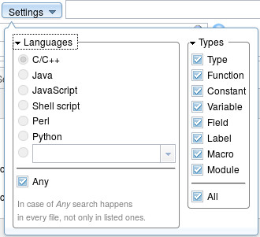

\subsubsection filesrc File Name Search
With "File name" search ou can use a regular expression (Perl syntax) for
matching  on full (absolute) path of files in the database.

Example:

    /path/.*/te?t\.cpp

\subsubsection logsrc Log Search
With log search you search for the code that probably creates the given log
record. It has no special syntax just copy and paste the log message to the
search field and hit the search button.

\subsection searchfiltering Filtering
For more accurate (and faster) results you can filter by programming language,
file name and by directory.

+ **Note 1:** In file name search you can't use any filter.
+ **Note 2:** The "Type" filter only works with "Definition Search".

### File filtering:
+ To the **File Filter** field you can write regular expression which is
  matched with the name of every relevant file during the query.
+ To the **Directory Filter** field you can also write regular expression which
  is mathced with the full path of the parent directory of a relevant file.
+ A file must match to the search query and with both filters (an empty field
  is like \.\*).

### Programming language filter (mime-type filter):
You can filter to files by its mime-type. The main usage of this feature is
filtering to files that wirtten in a given programming language. By clickig to
the **Settings** button you can set the language filter (the default is *ANY*).

\section filebrowser File Browser
File browsing is possible using the left Project Tree module. 
The project tree always shows the absolute path of each file. To find the root of the 
project just simply click one of the nodes with green icon. These are shortcuts
to some parts of the project, such as to the root of the directory containing 
the source code of the project.

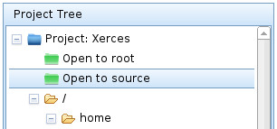

When a directory node is clicked, then the path of the directory is displayed 
in the header. This helps in filtering the search on directory. (See search)

A tree node can also be clicked with right mouse button. This action displays 
a popup menu of which the content depends on the clicked node. The clicked 
file or directory can be opened in new tab by selecting "Open in new tab" menu
item or by Middle Click on the tree node. Dependency diagrams (such as include
dependency, component usages, etc.) can also be reached by this popup menu (See
diagrams). One can see an outline of the clicked file by choosing "Info tree" 
menu item. 
This outline presents a few information about the file, like contained classes, 
functions, etc. These information can also be found in file outline.

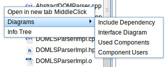

\section codemetrics Code metrics
Code metrics is an analysing tool. It helps to identify the complexity of our code. 
We can access it by left clicking on a directory/file at the filemanager. 
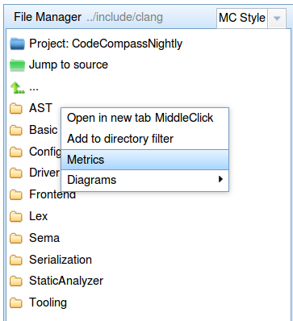

\subsection codemetricssettings Settings
Here we can set file type filter (the default is all), size and color
dimension of diagram.
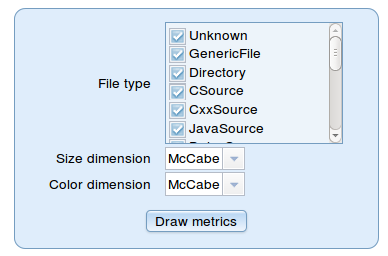

\subsection codemetricsdiagram Diagram
Metrics diagram shows directories/files in rectangles. The fill color goes from 
light green to blue. If it's light green than color dimension is zero, else color 
is representing the setted color dimension size(McCabe, Original Lines Of Code, CodeChecker bugs etc.).

\section cppanalysis C/C++ Analysis

\subsection cppcalagoue C++ Class Catalogue
Catalogue can be found in the left side at the Project Information tab. 
It shows the namespaces, classes and their doxygen documentation in a tree view.
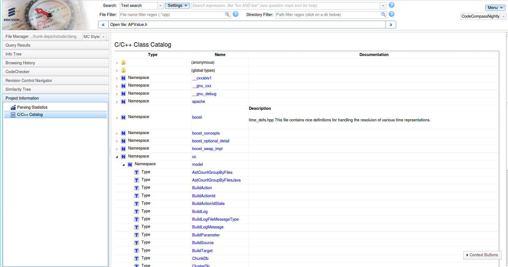

\subsection cppsyntaxhighlight Syntax highlighting
The meaning of syntax higlighting colors:

- Keyword
- Variable
- Type
- Function
- Function parameter passed by reference which can permanently change during the function call
- Enum
- Number
- Comment
- String
- Link
- Meta
- Property
- Operator
- Qualifier
- Bracket
- Tag
- Attribute
- Header
- Quote
- Hr
- Others

\subsection cppinfotree Info Tree in Source Code

Info Tree shows different information about given language elements such as
its name, qualified name, and place of definition. Further information are
described below depending on the element's type.

\subsubsection cppinfotreemacro Macros
CodeCompass is able to show information about defined macros. Clicking on a
macro with right mouse button and selecting "Info Tree", one can see the
place of definition, the places of its usage (expansion) and the places of
undefinitions.

If you would like to see the full recursive expansion of the macro, you can
click with right mouse button on it and selecting "Info Box". Info box generally
shows the definition of given language elements such as function, classes and
variables. The Doxygen documentation of a language element can also be found in
Info box by selection the "Documentation" tab on it.

\subsubsection cppinfotreetype Types
Info tree contains type specific information if it is called on a class/struct
name or enums.

In case of a class, one can find information in the Info Tree about inheritance
(from which classes this inherits and which classes inherit from this). The type
of inheritance (public, protected, private) is also shown.

Threw Info tree one can query the types which are aliases of the selected one,
i.e. declared as a typedef.

One can also see the friends, methods and attributes of the given class.

Finally there are different usages of the type:
- Places of global and static usage
- Places of usage as local variable type
- Places of usage as field
- Places of usage as function parameter
- Places of usage as return type

Info tree also shows information about enumeration types. Choosing an enum, one
can see its enum constants, their numeric values, and the place of its
definition. Enum constants can also be selected, thus querying its numeric value
and places of usage and definition.

\subsubsection cppinfotreefunction Functions
The following information are available in the info tree which belongs to a
function:
- Signature
- Return type
- Place of definition
- Places of declaraions
- Parameters
- Local variables
- Callers and callees
- Assignments to function parameters

The subtree of function callers can be opened recursively thus building a call
chain of the given function.

\subsubsection cppinfotreevariables Variables
Besides of the basic information about a variable (place of definition,
qualified name, etc.) you can list the places of reading and writing of the
given variable.

\subsection cppsourcediagrams Source Code Diagrams
Clicking on different language elements with right mouse button, the popup menu
contains different menu items. The diagrams are also specific on the clicked
item, i.e. in case of a user type, a class diagram can be viewed, in case of
functions the call diagram is available.

\subsubsection cppdiagramsclass Detailed UML Class Diagram
Detailed UML Class Diagram shows a simple class diagram about the selected type. In this
diagram besides the current node those classes are visible which inherit from
the current one and from which the current one is inherited. Each node displays
the members and methods of the given class.

\subsubsection cppdiagramsoverview UML Class Overview Diagram
UML Class Overview Diagram shows the complete inheritance relationship of the given
class, i.e. the path untill the root class, and every other classes which
inherit from the current one. Besides the inheritance relationship one can see
the aggregation relations of the current node, i.e. the types of the members of
the current class.

\subsubsection cppdiagramsfunctioncall Function Call Diagram
Function call diagram shows the called and caller functions of the current one
(yellow node). Called functions are drawn in blue and connected with blue
arrows, like caller functions and their arrows are red.

In C++ it is possible to call virtual functions which may have several
overridings. In this case the virtual function has diamond shape from which
overrider functions point out with dashed arrows. (Callers of a virtual
function are also connected with dashed arrow).

\subsubsection cppdiagramsfunctionpath Function Path Diagram
Function path diagram has two inputs. These are are the source and the target
functions. From under the diagram menu item you can choose both, however the
order is important: the source function has to be selected first. The result
graph shows all the call path between these two nodes.

\subsubsection cppdiagramscodebites CodeBites
By CodeBites diagram one can inspect the source code without loosing the visited
path. CodeBites can be called on functions, variables, classes or macros. In
each case the definition of the element is placed in a graph (tree) node. Since
an ordinary source code viewer is placed in the graph node, the parts of it are
also clickable. On click event the definition of the clicked element is opened
under the current one. The nodes of CodeBites graph are resizable and closable.

\subsubsection cppdiagramspointeranalysis Pointer Aliases
Pointer analysis is a fundamental static program analysis. The main goal of this 
diagram is to get a set of variable that the current pointer variable (yellow node) 
can refer to. The pointer analysis diagram shows the following relationships.
Pointer analysis implements "points to" analysis based on the well known Steensgaard algorithm.
This diagram is useful if you are interested in which other variables point to 
the same memory area as selected variable. So for a variable v it shows all 
(in)direct pointers pointing to v and all references that refer to v. 
The analysis is inter-procedural (across function calls) and flow insensitive 
(does not take into consideration branching) and takes into consideration all
value assignments in your program.

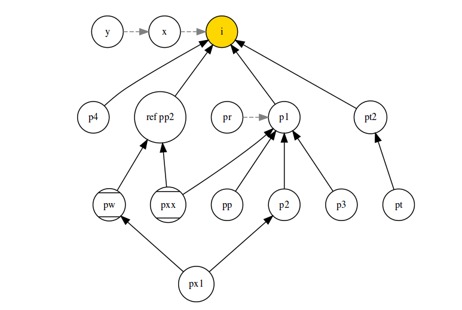
Diagram has two types of line:
  * The normal line(v1 -> v2) shows that v1 points to v2. 
  * The dashed line(v3 -> v1) shows that v3 is an alias of v1, or in other words, v3 is a reference to v1.

Node types:
  * Yellow circle(v2) - current variable.
  * Circle with two parallel line(v2) - variable can be null pointer.
  * Normal circle(v3, v1) - normal variable

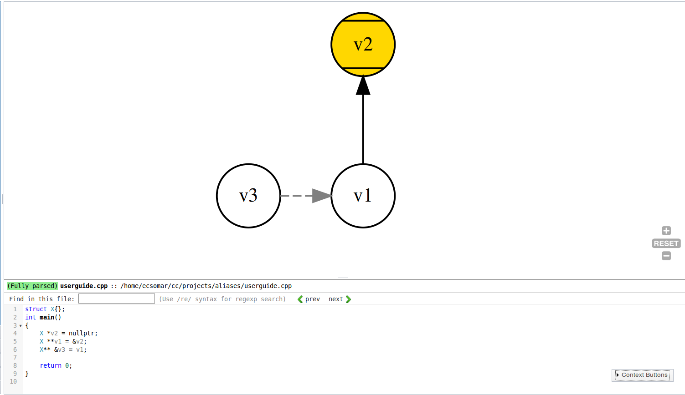

\subsection cppfilediagrams File Diagrams

File diagrams are available by right clicking on the file name in the Project
Tree.

<!--
\subsubsection cppfilediagraminclude Include Dependency

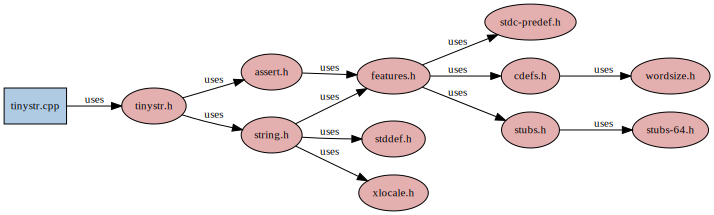

Include dependency diagram can be opened by clicking on a C/C++ source file in
the [Project Tree](#ptree) with right mouse button. This graph shows the files
which are included and included by the current one with #include directive.
-->
\subsubsection cppfilediagraminterface Interface Diagram
Interface diagram shows the used and provided interfaces of a source code file 
and shows linking information.

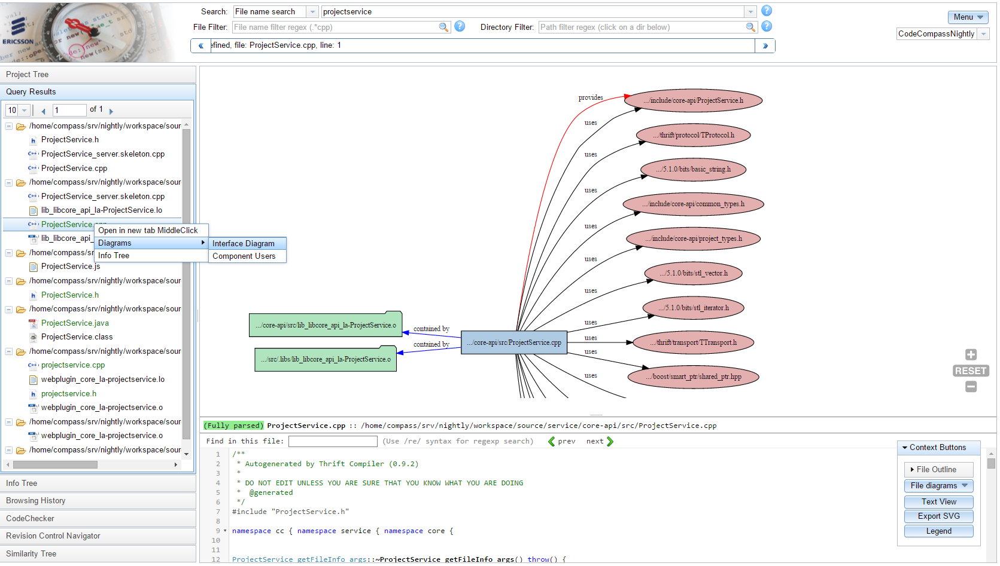

A source file (.cc) provides an header (.hh) file if it implements at least one 
function that was declared in the header file.

A source file (.cc) uses a header file if it includes the header, but does not
implement any declared functions. In this case we say that the source file 
is only a user of the interface.

An object _A_ contains a source file _S_ or another object _O_ if the source file is compiled
into that object or an object _O_ is linked object _A_.

\subsubsection cppfilediagramcomponentusers Component Users
Component users diagram fo source file _S_ shows wich source files depend on _S_
through the interfaces _S_ provides.
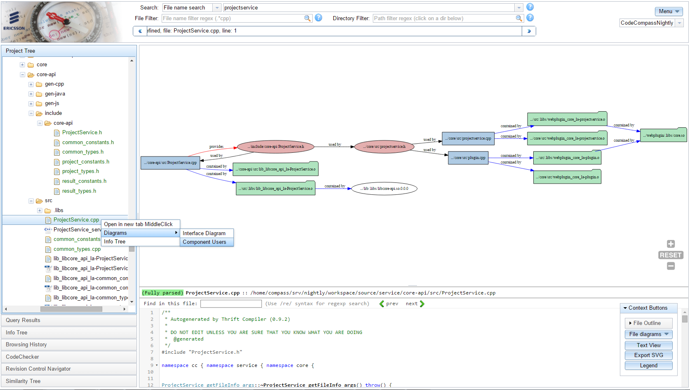

\subsubsection fileumloverviewdiagram UML Overview diagram
UML Class Overview Diagram shows the complete inheritance relationship of the given file,
i.e. the path untill the root class, and every other classes which inherit from the current one.
Besides the inheritance relationship one can see the aggregation relations of the current 
node, i.e. the types of the members of the current class.
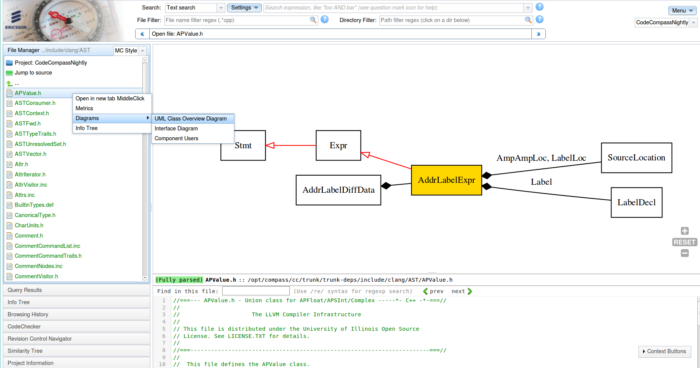

\subsection cppdirectorydiagrams Directory Diagrams

Directory diagrams are available by right clickin on a directory in the Project
Tree. Directory level diagrams show dependencies between directories in the project
they are useful to get a high level view of the relationships between directories
(which can be seen as modules).

\subsubsection dependson Depends On Diagram

This diagram shows the the module this directory depends on. The "depends on"
diagram on module _A_ traverses the subdirectories of module _A_ and shows
all directories that contain files that any of the source files in _A_ includes.

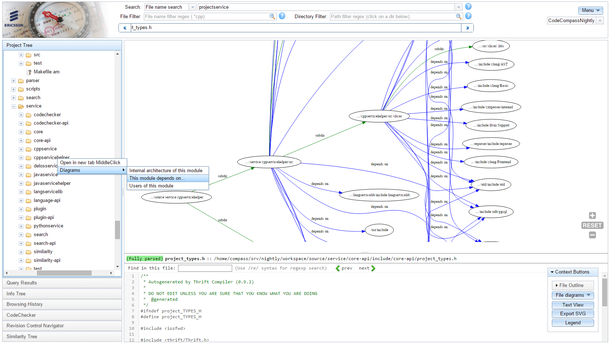

\subsubsection usersofmodule Users of a module 

This diagram shows the the directories (modules) that are users of the 
queried module.

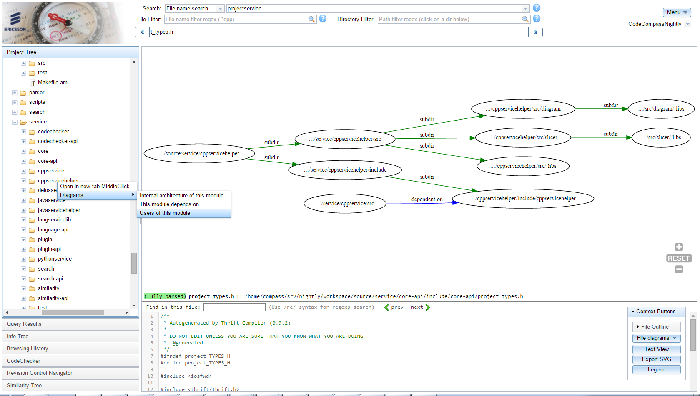

\subsubsection internalarch Internal Architecture of a module 

This diagram shows the the directories shows the relationships between
the subdirectories of the queried module. This diagram is useful to understand
the relationships of the subdirectories (submodules) of a module.

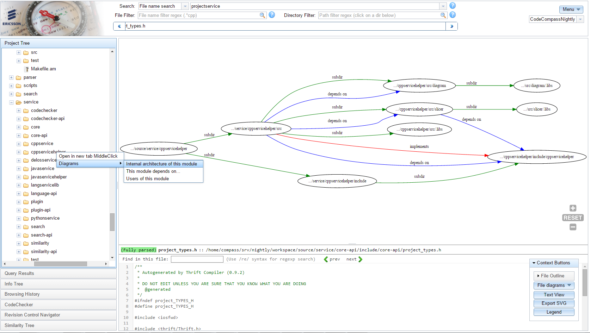

\subsubsection dirumloverviewdiagram UML Overview diagram
UML Class Overview Diagram shows the complete inheritance relationship of the 
declared classes in the files of the given directory, i.e. the path untill the root class, 
and every other classes which inherit from the current one. Besides the 
inheritance relationship one can see the aggregation relations of the current 
node, i.e. the types of the members of the current class.

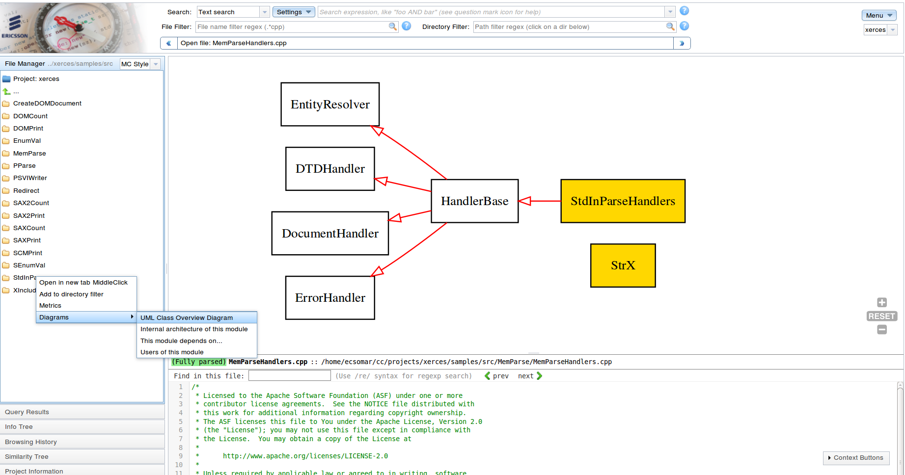

\subsection references References

Under the context menu there are several possibilities to query the source code
depending on a language element. For different elements different references are
available:

- Functions
  - Definition
    Returns where the given symbol is defined.
  - All usages
    Returns all usages of a given symbol.
  - Called functions
    Returns the definition of called fuctions.
  - Callers functions
    Returns the places where the queried function is called from.
  - Assignments to function pointers
- Variables
  - Definition
    Returns the location where the given varaible is defined.
  - All usages
    Returns all usages of a specific variable.
- Types (classes)
  - Definition
  - All usages

\section javaanalysis Java Analysis

Codecompass performs deep analysis for java files.
It can stores information symbol definitions, inheritance,
annotation, source code documentaion.

You can get detailed information about a symbol by right clicing to it.

  \subsection javainfotree Info Tree
    <!-- describe the elements of the info tree for this language-->    
    \subsubsection javainfotreetype Types
    The info tree provides summary information about the
      * Implemented interfaces
      * Classes that this class inherits from or inherited by
      * Member function and methods
      * Annotations for that class
      * Usages of this type: function local, field or as a parameter.
    \subsubsection javainfotreefunction Functions
    The info tree provides summary information about the
      * Annotation of a method
      * Parameters of the method
      * Local variables
      * Called functions
      * Caller functions
    \subsubsection javainfotreevariables Variables
      The info tree provides summary information about the
      * Locations of reads of a variable. If the variable reference is read
        or a method is called on the given object that counts as a read.
      * Location of writes of a variable. If the variable stands on the left side
        an assignment expression (so that the object reference changes)
        that counts as a write.
  
   \subsection javasourcediagrams Source Code Diagrams
    <!-- describe all diagrams available for this language following the context menu naming-->
    The following diagrams are implemented in java
      * Function call diagram. Shows the call graph of a function.
      * CodeBites diagram of a function.
      * UML Class diagram for a Class. 
      * Class hierarchy diagram for a class.       
    
  \subsection javareferences References
    <!-- describe all references available for this language following the context menu naming-->
    \subsubsection javareferencesgetdefinition Get Definition.
      Returns the definition of a symbol.
    \subsubsection javareferencesgetusage Get Usage
      Returns all usages of a type, function or variable.

    
\section python Python Analysis

Codecompass performs deep analysis for python files.
It can stores information symbol definitions, inheritance,
annotation, source code documentation. It resolves imports an provides a 
type inference solution for python variables.

\subsection pythonTypeInference Type Inference

Since Python is not a type-safe language, you do not need to define type of
function parameters. Unlike in C where the type of parameters are explicit Python
applies duck typing and the type of the object is only determined in run-time.
Codecompass tries to find out type of the parameters checking the type of the 
parameters at the place of call. Since at different call locations the
object may have different types, a set of types is stored for an object.

This type inference capability is a very powerful feature of CodeCompass.
Most IDEs can only identify function calls based on name matching 
the arity of the function, CodeCompass on the other hand uses the type infernce
to give more precise set for callers of a function.

\subsection pythonFunc Resolution of callers

Please consider the following example to demonstrate the power of
type inference in codecompass.

        class Creature:
        
            def __init__(self, name):
                self.name = name
        
            def talk(self):
                raise NotImplementedError("Subclass must implement abstract method")
        
        
        class Animal(Creature):
        
            def talk(self):
                return '...'
        
        
        class Cat(Animal):
        
            def talk(self):
                return 'Meow!'
        
        
        class Dog(Animal):
        
            def talk(self):
                return 'Woof! Woof!'
        
        
        class Lion(Animal):
        
            def talk(self, param1, param2):
                return "Rawr!!!"
        
        
        class Elephant(Animal):
        
            def talk(self, *args, **kwargs):
                return "Toot."
        
        
        class Crow(Animal):
        
            def talk(self, csor=1):
                return "Tweet."
        
        
        
        animals = [ Cat('Missy'),
                    Cat('Mr. Mistoffelees'),
                    Dog('Lassie') ]
        
        
        #The talk call definitions:
        #resolved: Cat, Dog
        #possible: Animal, Creature, Cat, Crow, Dog, Elephant, overriden_method_import
        # overriden_methods.talk
        for animal in animals:
            print animal.name + ': ' + animal.talk()

In this example when you rifht click _animal.talk()_ function call to get definitions, Codecompass can
correctly infer that that the function implementation is either _Cat.talk()_
or _Dog.talk()_. Sometimes the definition lookup based on type inference is 
incomplete. For these cases Codecompass also performs definition lookup by 
matching the function name and the number of parameters.
In codecompass this is called "Possible definitions", shown in the right 
click context menu.

  
